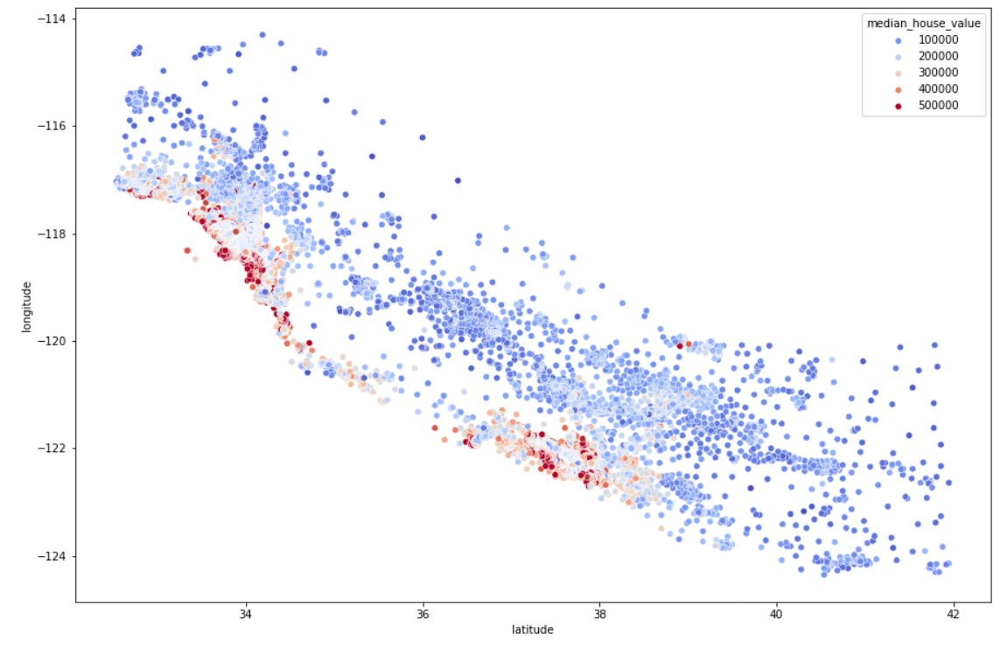

#  House Price Prediction Model
 Built and optimized a predictive regression model of housing prices with historical CA housing data.

# Table of Contents

1. [Background](#1-|-background)
1. [Project Overview](#2-|-project-overview)
1. [Exploring the Dataset](#3-|-Exploring-the-Dataset)
1. [Machine Learning considerations](#4-|-conclusions)
1. [Dependencies](#5-|-dependencies)
1. [Author](#6-|-author)
1. [License](#7-|-license)
1. [Acknowledgements](#8-|-acknowledgements)

# 1 | Background
[THIS](https://www.kaggle.com/datasets/camnugent/california-housing-prices/data) is the dataset used in the second chapter of Aurélien Géron's recent book 'Hands-On Machine learning with Scikit-Learn and TensorFlow'. It serves as an excellent introduction to implementing machine learning algorithms because it requires rudimentary data cleaning, has an easily understandable list of variables and sits at an optimal size between being to toyish and too cumbersome.

The data contains information from the 1990 California census. So although it may not help you with predicting current housing prices like the Zillow Zestimate dataset, it does provide an accessible introductory dataset for teaching people about the basics of machine learning.

# 2 | Project Overview
Many factors affect the value of a house property (eg. location, size, condition, age, etc). Predicting property prices is challenging due to the large number of factors that can affect them. In addition, the limited availability of data means that feature engineering is required to extract meaningful insights from the data. As a result, it is generally difficult to accurately predict property prices that take into account all the factors that influence them.

This project consists of 3 key parts:

1. Identification of **outliers** in the dataset
1. Creation and modification of the features, `Feature Engineering`, we want to input a feature matrix that will help teach the model data that is most relevant to the prediction of a target variable
1. Developing the actual model to predict the `median_house_value` which is our **target variable**

# 3 | Exploring the Dataset
The columns are as follows, their names are pretty self explanitory:
* longitude
* latitude
* housing_median_age
* total_rooms
* total_bedrooms
* population
* households
* median_income
* median_house_value
* ocean_proximity

Each row pertains to a GROUP of houses (by block), therefore each row represents MEDIAN values of houses in close proximity grouped together.

The dataset has a number of features with some missing data, but not too many instances overall (257/20640); to save time, we simply dropped those rows since the missing data is small compared to the total data.

## Observations & Patterns
- There are some housing blocks with old age homes in them.

- We will need to split the ocean_proximity into binary columns. 

- We should standardize the scale of the data for any non-tree based methods. As some of the variables range from 0-10, while others go up to 500,000.

- The `Median_house_value` feature has an peak at its maximum value (around 500k), which could be an outlier. This is probably due to "posh" high-end houses on the coast or on various islands.

- Population, total_bedrooms, and total_rooms all describe connected attributes, which is revealed by their similar distribution in histogram plots.

# 4 | Conclusions

As expected, the most positive correlation variables are: median_income, <1H Ocean, Near Bay, and household_rooms. Median income was the strongest indicator of housing value. Nearness to the ocean was the second strongest indicator, showing that house value increases as one approaches the coast. Number of rooms in the household was the third strongest indicator, showing that even a larger inland multi-room house will have a lower value than a smaller house near the coast.

# 5 | Dependencies
A list of dependencies is included in the pyproject.toml file in this repository.
* python = "^3.10"
* numpy = "^1.25"
* pandas = "^2.0"
* matplotlib = "^3.8.0"
* seaborn = "^0.13.0"
* scikit-learn = "^1.3.1"

# 6 | Author
[Ahmed L Rashed](https://ahmedlrashed.github.io)

# 7 | License

# 8 | Acknowledgements
* [Kaggle](https://www.kaggle.com/) for hosting the dataset
* [ANDREY SHTRAUSS](https://shtrausslearning.github.io/) for informing and inspiring the more advanced ML techniquies

